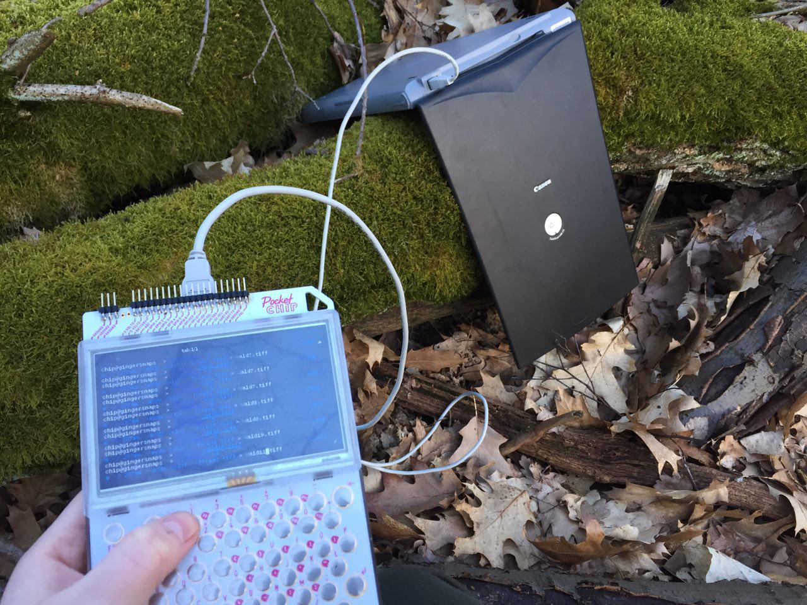
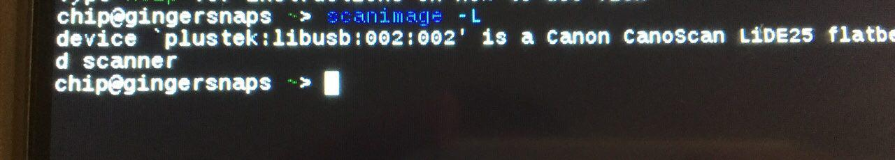
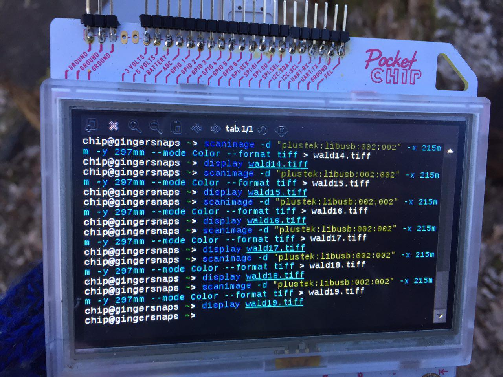
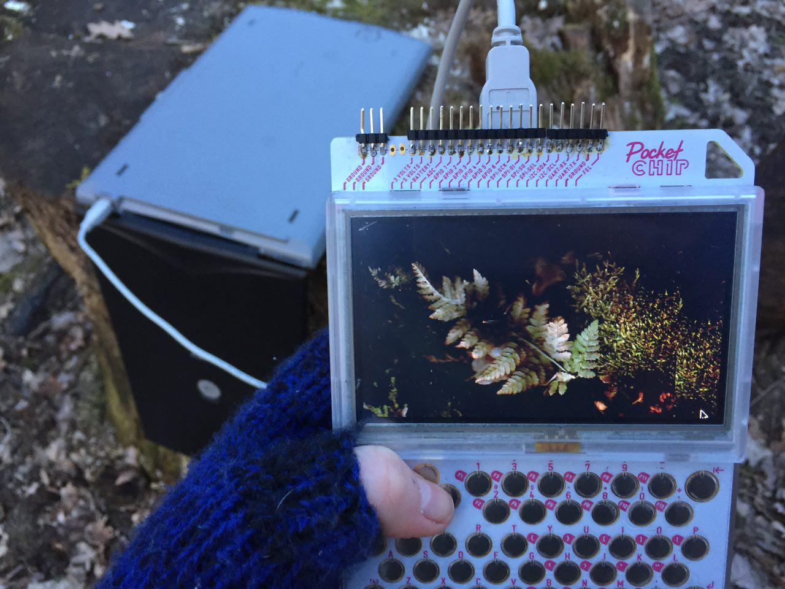
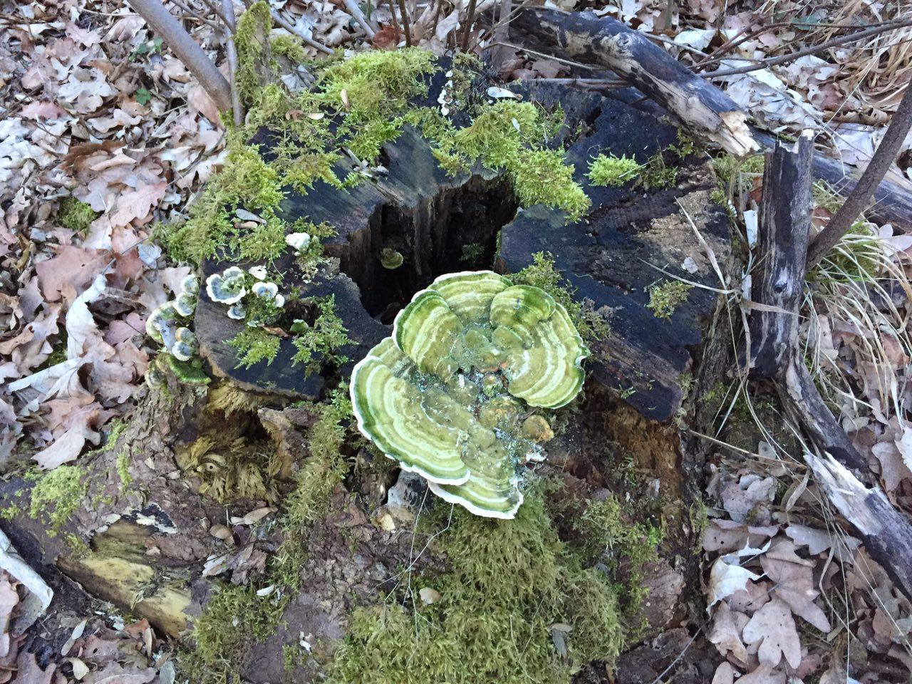
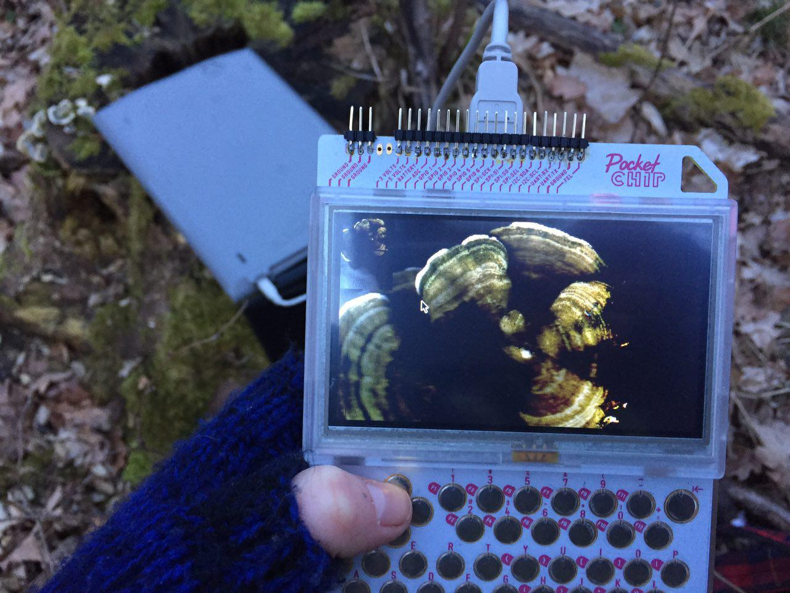

# pocketCHIP-photography
Take photos with your pocketCHIP

### Experiment I
## Scanography

A flatbed scanner and a pocketCHIP walk into the woods...



Have you ever tried using your old flatbed scanner as a giant digital camera? No? Well, this is actually a thing and it's called [Scanography](https://en.wikipedia.org/wiki/Scanography)!

The cool thing is you don't need much to get started and it pretty much works out of the box! Old flatbed scanners are cheap (I got mine off eBay for 1€) or you might even still have one lying around somewhere collecting dust.

I read in some obscure scanography forum that those scanners from CanoScan line by Canon are supposed to work best for scanography - but I guess any scanner will do. You might want to choose one that's light and doesn't use much power. The one I used here is a _CanoScan LIDE 25_ and it worked just fine. It's a scanner hey! ;)

Power consumption is minimal, too. I took around 40 scans and my pocketCHIP went from 3 bars to 2 - so I didn't even need to bring along an extra battery.

#### Got your scanner ready? Let's do this!

For controlling our scanner and getting images into our pocketCHIP we'll be using the [scanimage](http://linuxcommand.org/man_pages/scanimage1.html) library - and it's most likely it's already installed on your CHIP!

Plug in your scanner, go to the terminal and type `scanimage` and hit Enter.

There should be a prompt:
```
scanimage: output is not a file, exiting
```

This means that scanimage is installed on your pocketCHIP and it recognized your scanner.

If scanimage happens _not_ to be installed:
```
sudo apt-get update
sudo apt-get install scanimage
```

Next you'll need to find out your scanner's name:
`scanimage -L`. This will list the connected scanning/camera devices.

In my case it looks like this:


`plustek:libusb:002:002` is my scanner's name.

Let's create a directory where we want to store our scans in e.g. "scans" and go to that directory:

```
mkdir scans
cd scans
```

Before we get scanning - one more thing - find out your scanner's scan area dimensions, so you won't end up with only a small rectangle in some corner and make use of the entire scan area available!

```
scanimage --help -d "your device's name"
```

You should get back a list with tons of options etc. - scroll down to _Geometry_ and write down your scanner's scan area dimensions. It should look something like this:

```
-x 0..215mm
  Width of scan area.
-y 0..297mm
  Height of scan area.
```

This means we have a max scan area of 215mm x 297mm.

#### Let's get scanning!!

All set? Here we go!

```
scanimage -d "your device's name" -x 215mm -y 297mm --mode color --format tiff > scan.tiff
```

That's it! Your scanner should now start making some weird noises. Wait until it's done (it might take a while)!



To view your scan: `display scan.tiff`. Enjoy! (esc brings you back to terminal)

__Note__: Don't forget to alter the file name for your next scan or you'll overwrite your previous one. ;)

_If you're new to using the terminal: you don't have to type in that long scan command every time - press "up" and the terminal will show you your last command. Press "up" twice and it will show you your second last command and so on! (pretty neat, huh?)_

#### Getting your photos from pocketCHIP onto your computer!

So you've taken lotta cool scans and want to move them onto your laptop now? No problem!

Make sure your pocketCHIP is on the same WIFI as your computer, go to your scan directory and start an HTTP server.

Ah halt! First you need to find out your pocketCHIP's IP address:

```
ip addr show
```

It's listed right after `inet` (_not_ 127.0.0.1 - that's home, scroll a bit further down!)

Got it? Good!

Now start the HTTP server:

```
python -m simpleHTTPServer 8000
```

Open a browser on your computer and go to [your CHIP's IP]:8000.

Tada! Now you're serving your pocketCHIP scans on your WIFI and can view them on your computer!


To close down the HTTP server on your pocketCHIP hit `CRTL + c`.

#### Tips

Of course flat surfaces will work best for taking images with a scanner! The further away things are the darker (or brighter!) and blurrier they get. If you want to minimize light "leakage" put a piece of cloth (e.g. your hoodie) over your scanner. This will leave you with dark borders instead of white ones. Unless you want that effect - then no hoodie, of course! :)

I personally prefer the scans with darker borders as they look like they've been taken during night. (so goth!)

Oh and: Expect all sorts of glitches!!! :D

Tree trunks work _really_ well!





_When you decide to go out and about in the woods, be careful not to break/kill anything! Respect nature, yo! Also don't go in the late afternoon without a torch, so you won't end up wandering in the dark fearing to be run over by wild boar like me..._

__View all my scans I took in the wood with my pocketCHIP here: [https://flic.kr/s/aHskWbe2BP](https://flic.kr/s/aHskWbe2BP)__

#### Disclaimer
This tutorial is meant for people just starting out with their pocketCHIPs and who are not 1337 yet. ;)
Of course there are more nerdy ways (coming up soon!) to do this, but I tried to make this as easy and accessible as possible! _I hope it is!_ So no eye-rolling plz! :p
